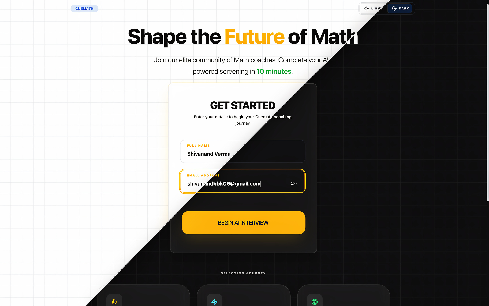
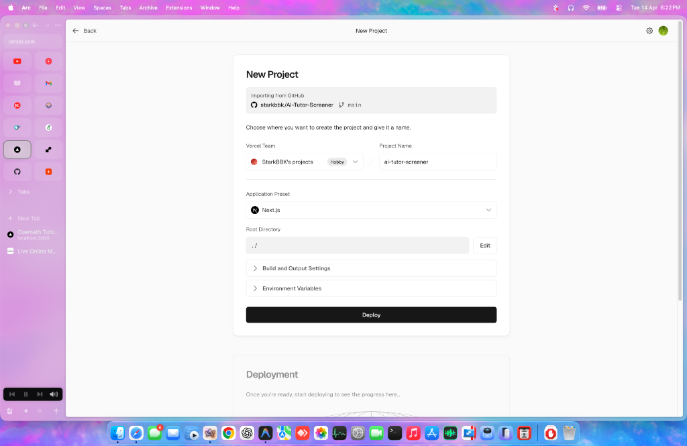

# 🎭 Cuemath AI Tutor Screener

> **An AI-powered voice interview platform that screens tutor candidates in 8 minutes — replacing expensive, slow human screening calls with intelligent, scalable automation.**

🔗 **Live Demo:** [ai-tutor-screener-tau.vercel.app](https://ai-tutor-screener-tau.vercel.app)

---

## 🎯 The Problem

Cuemath hires **hundreds of tutors every month**. Each candidate goes through a 10-minute screening call with a human interviewer to assess soft skills — communication clarity, patience, warmth, ability to simplify concepts, and teaching instinct.

This process is:
- **Expensive** — dedicated interviewers on payroll
- **Slow** — scheduling calls takes 3-5 days per candidate
- **Hard to scale** — one interviewer can only handle 20-30 candidates per day
- **Inconsistent** — different interviewers, different standards

## 💡 The Solution

An **AI interviewer** that conducts professional voice-based screening interviews **24/7, instantly, at near-zero cost**.

The candidate visits the website → speaks naturally with the AI interviewer → answers 6 carefully designed questions → receives an automated assessment report with scores across 5 teaching dimensions.

**What used to take 3-5 days and a human interviewer now takes 8 minutes and costs practically nothing.**

---

## ✨ Key Features

### 🎙️ Voice-First, Hands-Free Interview
- **No buttons to press** — the candidate just talks naturally, like a real phone call
- AI speaks questions using natural text-to-speech
- Real-time speech recognition captures candidate responses
- Automatic silence detection (5 seconds) seamlessly moves the conversation forward
- Text fallback mode for unsupported browsers

### 🤖 Intelligent AI Interviewer
- Powered by **Llama 3.3 70B** via Groq — fast, intelligent, and free
- **English-only** professional conversation with warm, encouraging tone
- **Smart follow-ups** — asks candidates to elaborate on vague or short answers
- **Nonsense detection** — catches irrelevant answers and politely redirects
- **Never gets stuck** — auto-skips to next question after 2 failed attempts
- Natural acknowledgments — varies responses instead of saying "Great answer!" every time

### 📊 Comprehensive Assessment Report
- **Overall score** out of 100 with color-coded progress ring
- **Recommendation level**: Strong Recommend / Recommend / Maybe / Not Recommended
- **5-dimension scoring** (each 0-20):
  - 💬 Communication Clarity
  - 🤗 Warmth & Patience
  - 🧩 Simplification Ability
  - 🗣️ English Fluency
  - 🎓 Teaching Instinct
- **Evidence-based** — each dimension includes a direct quote from the interview
- **Strengths & Areas for Improvement** — actionable insights
- **Full interview transcript** with timestamps

### 📥 PDF Export
- One-click professional PDF report generation
- Clean formatting suitable for HR review and filing
- Includes all scores, dimensions, evidence quotes, and transcript

### 🎨 Premium UI/UX
- **Dark/Light mode** with smooth transitions
- **Glassmorphism aesthetics** — frosted glass cards, subtle gradients
- **Range Rover-style sequential animations** on mic test page
- **Fully responsive** — works on desktop, tablet, and mobile
- **Cuemath brand alignment** — professional, trustworthy, welcoming
- **Pre-interview mic test** — builds candidate confidence before the real interview

### 🔒 Reliability & Security
- **Multi-key API fallback system** — automatically rotates between 4 Groq API keys
- **Zero downtime** — if one key hits rate limit, seamlessly switches to next
- **No exposed credentials** — all API keys server-side only
- **Graceful error handling** — users never see technical error messages

---

## 🛠️ Tech Stack

| Layer | Technology | Why |
|-------|-----------|-----|
| **Framework** | Next.js 15 (App Router) | Full-stack in one project, easy Vercel deployment |
| **Language** | TypeScript | Type safety, better developer experience |
| **AI Model** | Llama 3.3 70B (via Groq) | Free tier, ultra-fast inference, excellent quality |
| **Speech-to-Text** | Web Speech API | Free, built-in, no server processing needed |
| **Text-to-Speech** | Browser SpeechSynthesis | Free, instant, works offline |
| **Styling** | Tailwind CSS + Custom CSS | Rapid development with premium custom touches |
| **Animations** | CSS Animations + Framer Motion | Smooth, performant transitions |
| **State Management** | React Context + Hooks | Lightweight, no extra dependencies |
| **PDF Generation** | html2canvas-pro + jsPDF | Client-side PDF with print fallback |
| **Deployment** | Vercel | Zero-config, automatic deployments, free tier |

---

## 📸 Screenshots

### 🏠 Landing Page
Clean, professional entry point with candidate registration.



### 🎤 Microphone Test
Hardware readiness check with premium sequential arrow animations.


### 🤖 Interview Room
The heart of the experience — structured 1:1 AI screening session with real-time transcription.


### 📊 Assessment Report
Comprehensive evaluation with dimensional scoring and evidence quotes.



---

## 🏗️ Architecture

```
┌─────────────────────────────────────────────────┐
│                   Frontend                       │
│  Landing → Mic Test → Interview Room → Report    │
│  (Next.js + React + Tailwind)                    │
└──────────────────────┬──────────────────────────┘
                       │
            ┌──────────┴──────────┐
            │   API Routes        │
            │  /api/chat          │ ← Interview conversation
            │  /api/assess        │ ← Assessment generation
            └──────────┬──────────┘
                       │
         ┌─────────────┴─────────────┐
         │   Groq API (Server-side)  │
         │   Key 1 → Key 2 → Key 3  │ ← Auto-fallback
         │   → Key 4                 │
         │   Model: Llama 3.3 70B   │
         └───────────────────────────┘
```

### Interview Flow
```
Candidate enters name/email
        ↓
Microphone test (hardware check)
        ↓
"Begin Interview" tap (unlocks mobile audio)
        ↓
AI greets candidate → asks Q1
        ↓
Candidate speaks → AI listens (5s silence = auto-submit)
        ↓
AI acknowledges → asks follow-up if needed → moves to next Q
        ↓
(Repeat for 6 questions)
        ↓
AI closing message → auto-redirect
        ↓
Full transcript sent to Groq for assessment
        ↓
Detailed report with 5-dimension scoring
        ↓
PDF download available
```

---

## ⚙️ Setup & Installation

### Prerequisites
- Node.js 18+
- npm or yarn
- Groq API key ([console.groq.com](https://console.groq.com))

### 1. Clone the repository
```bash
git clone https://github.com/starkbbk/AI-Tutor-Screener.git
cd AI-Tutor-Screener
```

### 2. Install dependencies
```bash
npm install
```

### 3. Configure environment variables
Create a `.env.local` file in the root:
```env
GROQ_API_KEY_1=gsk_your_first_key
GROQ_API_KEY_2=gsk_your_second_key
GROQ_API_KEY_3=gsk_your_third_key
GROQ_API_KEY_4=gsk_your_fourth_key
```

### 4. Run locally
```bash
npm run dev
```
Open [http://localhost:3000](http://localhost:3000)

---

## 🚀 Deployment (Vercel)

1. **Push to GitHub**
2. **Import to Vercel**: Connect your GitHub repository
3. **Set environment variables**: Add all `GROQ_API_KEY_*` variables in Vercel Settings → Environment Variables
4. **Deploy**: Vercel automatically builds and deploys

---

## 🎯 Design Decisions & Tradeoffs

| Decision | Why | Tradeoff |
|----------|-----|----------|
| **Groq over OpenAI/Gemini** | Free tier with 100K tokens/day, ultra-fast inference | Llama 3.3 slightly less capable than GPT-4, but excellent for this use case |
| **Web Speech API over Whisper** | Free, instant, no server processing | Only works on Chrome/Safari — added text fallback for others |
| **Multi-key fallback system** | Ensures zero downtime on free tier | Requires multiple Groq accounts |
| **localStorage over database** | No setup cost, instant deployment, privacy | Data not persisted across devices — would need PostgreSQL for production |
| **Hands-free voice flow** | Feels like a real interview, better candidate experience | More complex state management than tap-to-speak |
| **Frontend question tracking** | Prevents AI from getting stuck or restarting | Slightly less flexible than letting AI fully control the flow |
| **Browser TTS over ElevenLabs** | Free, no API cost, works offline | Less natural than ElevenLabs — acceptable tradeoff for free tier |

---

## 🔮 What I Would Add With More Time

1. **PostgreSQL database** — persist all interviews, enable search and analytics
2. **HR Admin Dashboard** — view all candidates, filter by score, compare side-by-side
3. **Whisper API integration** — better transcription accuracy for Indian English accents
4. **ElevenLabs TTS** — more natural, human-like AI voice
5. **Email notifications** — auto-email candidate results and HR team summaries
6. **Customizable question sets** — different questions for different tutor roles
7. **Multi-language support** — conduct interviews in Hindi and other regional languages
8. **Analytics dashboard** — completion rates, average scores, drop-off analysis
9. **Audio recording** — store actual voice recordings alongside transcripts
10. **Comparison view** — compare two candidates side-by-side

---

## 🧪 Testing

### Good Candidate Test (Expected: 80-90 score)
Give detailed, thoughtful answers about teaching philosophy, use real examples, show patience and creativity.

### Average Candidate Test (Expected: 50-65 score)
Give short but relevant answers. AI should ask follow-up questions.

### Poor Candidate Test (Expected: 20-35 score)
Give one-word answers or irrelevant responses. AI should catch this and score accordingly.

---

## 📂 Project Structure

```
├── app/
│   ├── page.tsx              # Landing page
│   ├── mic-test/page.tsx     # Microphone test
│   ├── interview/page.tsx    # Interview room
│   ├── report/page.tsx       # Assessment report
│   ├── api/
│   │   ├── chat/route.ts     # AI conversation endpoint
│   │   └── assess/route.ts   # Assessment generation endpoint
│   ├── layout.tsx            # Root layout
│   └── globals.css           # Global styles
├── components/               # Reusable UI components
├── context/                  # React Context providers
├── lib/                      # Utilities, constants, types
├── public/                   # Static assets
├── .env.local                # API keys (not in repo)
└── README.md                 # This file
```

---

## 👨💻 Author

Built as part of the **Cuemath AI Builder Challenge** — a take-home build challenge for the AI Builder role on Cuemath's Product Team.

---

## 📄 License

MIT License. Built for Cuemath Tutor Screening.
