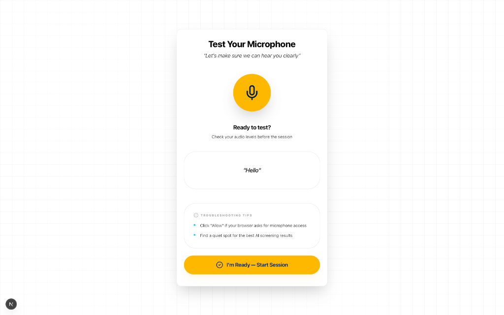
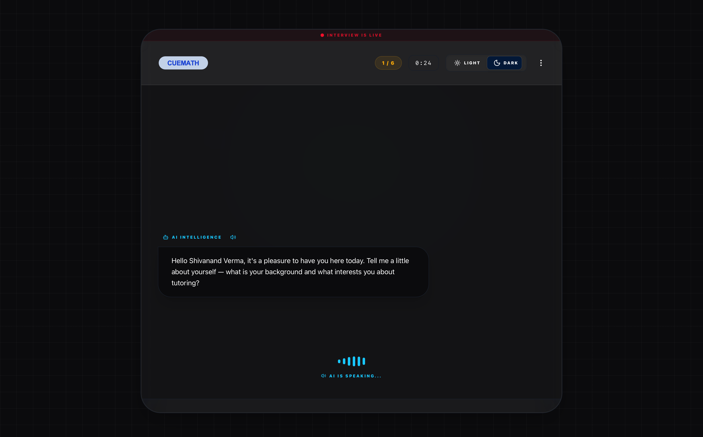

# 🎭 Cuemath AI Tutor Screener

An intelligent, voice-first screening platform built for **Cuemath**. This application uses Llama-3.3 (via Groq) to conduct professional tutor interviews, assess teaching skills, and generate automated evaluation reports.

---

## 🌟 Key Features

- **🎙️ Voice-First Interaction**: Seamless audio-based interviewing with real-time feedback.
- **🤖 Specialized AI Interviewer**: A professional, English-only persona that handles 6 core pedagogical questions.
- **📊 Automated Assessment**: Instant generation of detailed reports covering communication, warmth, and teaching ability.
- **📥 PDF Export**: Download high-quality evaluation reports for internal review.
- **🌓 Adaptive Theme**: Stunning Dark/Light modes with premium glassmorphism aesthetics.

---

## 📸 Core Experience


### 🎙️ Pre-Session Mic Test
Ensuring hardware readiness with a simple, intuitive audio check.


### 🤖 Live Interview Room
The heart of the experience—conducting structured 1:1 screening sessions.



---

## 🛠️ Tech Stack

- **Framework**: [Next.js 15+](https://nextjs.org) (App Router)
- **Styling**: Vanilla CSS + Tailwind for layout
- **AI Engine**: Groq (Llama-3.3-70b)
- **State Management**: React Context + Hooks
- **PDF Generation**: html2canvas + jsPDF

---

## ⚙️ Setup & Installation

### 1. Clone the repository
```bash
git clone https://github.com/starkbbk/AI-Tutor-Screener.git
cd AI-Tutor-Screener
```

### 2. Install dependencies
```bash
npm install
```

### 3. Configure Environment Variables
Create a `.env.local` file in the root:
```env
GROQ_API_KEY=your_gsk_key_here
```

### 4. Run Locally
```bash
npm run dev
```

---

## 🚀 Deployment on Vercel

1. **Connect GitHub**: Import your repository to Vercel.
2. **Set Variables**: Add `GROQ_API_KEY` in the Environment Variables tab.
3. **Build**: Vercel will automatically build and deploy.

---

## 📄 License
MIT License. Created for Cuemath Tutor Screening.
