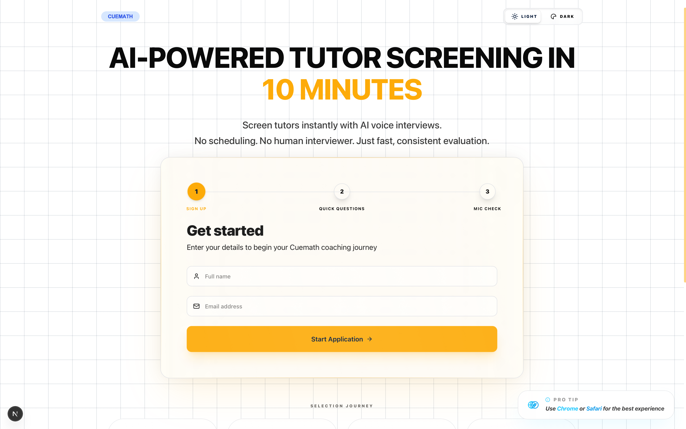
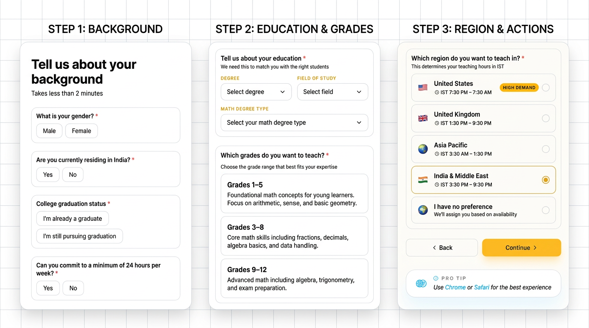
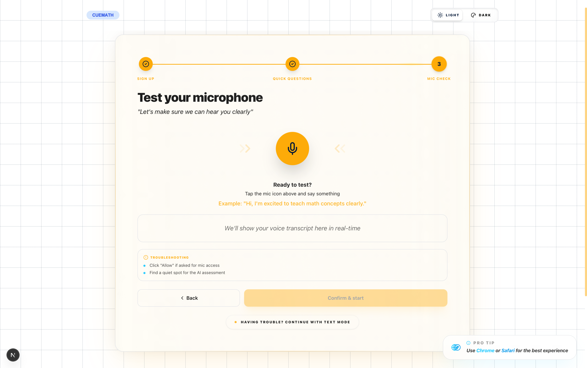

# 🎭 Cuemath AI Tutor Screener
> 🚀 AI interviewer that screens tutor candidates in ~10 minutes — no human calls, no scheduling, no delays.
> ⚡ Built using free-tier tools to simulate a real-world scalable hiring system.

🔗 **Live Demo:** [ai-tutor-screener-tau.vercel.app](https://ai-tutor-screener-tau.vercel.app)

## 🚀 Quick Demo


## 🖼️ Screenshots
### Landing

### Application

### Mic Test

### Interview 

### Report


---

## 🎯 The Problem

Cuemath hires **hundreds of tutors every month**. Each candidate goes through a 10-minute screening call with a human interviewer to assess soft skills — communication clarity, patience, warmth, ability to simplify concepts, and teaching instinct.

This process is:
- **Expensive** — dedicated interviewers on payroll
- **Slow** — scheduling calls takes 3-5 days per candidate
- **Hard to scale** — one interviewer can only handle 20-30 candidates per day
- **Inconsistent** — different interviewers, different standards

## 📈 Impact
- ⏱️ Reduced screening time from **3–5 days → ~10 minutes**
- 💰 Eliminates dependency on human interviewers
- 📊 Consistent, bias-free evaluation across all candidates
- ⚡ Scales to **unlimited candidates simultaneously**

---

## 💡 The Solution

An **AI interviewer** that conducts professional voice-based screening interviews **24/7, instantly, at near-zero cost**.

The candidate visits the website → speaks naturally with the AI interviewer → answers 6 carefully designed questions → receives an automated assessment report with scores across 5 teaching dimensions.

**What used to take 3-5 days and a human interviewer now takes 8 minutes and costs practically nothing.**

---

## 🚀 Why This Scales
| | Human Screener | AI Screener |
|---|---|---|
| **Availability** | Business hours only | 24/7 |
| **Speed** | 3–5 days | Instant |
| **Cost** | High | Near-zero |
| **Capacity** | 20–30/day | Unlimited |
| **Consistency** | Varies | Standardized |

---

## ⚡ TL;DR
- 🎙️ Real-time AI voice interview (not chatbot)
- 🧠 Intelligent interviewer (Maya)
- 📊 Auto scoring + detailed report
- 📄 One-click PDF export
- ⚡ Fully automated pipeline

## ✨ Key Features

### 🎙️ Human-Like Voice Interview
- **ElevenLabs TTS integration** — AI speaks with a natural voice profile
- **Multi-key fallback system** — rotates API keys to ensure uninterrupted service
- **Automatic browser TTS fallback** — seamless backup when quotas exhaust
- **Real-time speech recognition** captures candidate responses with zero-lag character-by-character feedback
- **Automatic silence detection** moves the conversation forward naturally

### 🤖 Intelligent AI Interviewer (Maya)
<table>
  <tr>
    <td></td>
    <td><strong>Maya</strong><br><span style="color: grey;">AI Tutor Screener</span></td>
  </tr>
</table>

- Powered by **Llama 3.3 70B** via Groq — ultra-fast, intelligent inference
- **One question per turn** — linear, bulletproof interview flow
- **Strict question tracking** — AI cannot repeat or skip questions
- **Nonsense detection** — catches irrelevant answers and redirects politely
- **Auto-completion** — interview ends automatically after all 6 questions

### 📊 Comprehensive Assessment Report
- **Overall score** out of 100 with color-coded progress ring
- **Recommendation level**: Strong Recommend / Recommend / Maybe / Not Recommended
- **5-dimension scoring**: Clarity, Warmth, Simplification, Fluency, and Teaching Instinct
- **Evidence-based** — each dimension includes a direct quote from the interview
- **Full interview transcript** with timestamps

### 📥 Smart PDF Pagination Engine
- **Granular Page Capture** — renders content block-by-block to prevent text slicing
- **Section Grouping** — headings and associated items always stay together
- **High-Contrast Print Support** — automatically adapts themes for professional copies

### 💎 The "Liquid Glass" Design System
- **Cinematic Wide Layout** — spacious `max-w-5xl` container for a "command-center" feel
- **Glass Shine Effects** — sleek light-sweep animations on cards
- **Spring Physics** — ultra-responsive, tactile motion system
- **Pixel-Perfect Theme Continuity** — adaptive colors that look great in light and dark modes

### 🗺️ Selection Journey
Landing → Application → Mic Test → AI Interview → Report → PDF

---

## 🛠️ Tech Stack

| Layer | Technology | Why |
|-------|-----------|-----|
| **Framework** | Next.js 15 (App Router) | Full-stack simplicity, App Router performance |
| **Language** | TypeScript | Type safety and developer experience |
| **AI Model** | Llama 3.3 70B (via Groq) | Ultra-fast inference, high-quality reasoning |
| **Voice (TTS)** | ElevenLabs API | Industry-leading natural voice synthesis |
| **Speech-to-Text** | Web Speech API | Free, built-in, instant browser-side processing |
| **Styling** | Tailwind CSS | Rapid development with premium custom touches |
| **Animations** | Framer Motion | Smooth, performant transitions |

## 🧩 What Makes This Different
- Not a chatbot — a **structured interview system**
- Frontend-controlled question flow (no LLM randomness)
- Multi-API fallback (Groq + ElevenLabs)
- Handles real-world failures (timeouts, silence, nonsense input)
- Designed like a **production system**, not a demo

---

## 🧠 Real Engineering Problems I Solved

### 1. AI Getting Stuck in Loops
**Problem:** LLM would sometimes repeat questions or deviate from the screening goals.
**Solution:** Frontend owns the question state. The AI only generates acknowledgment and receives the specific next question from the system prompt. Deterministic flow.

### 2. Robotic Voice Killing the Experience
**Problem:** Browser SpeechSynthesis sounds artificial, breaking candidate immersion.
**Solution:** Integrated ElevenLabs TTS with a natural voice profile and a multi-key rotation system for zero downtime on free quotas.

### 3. Text Appearing Before Voice
**Problem:** AI response text appearing instantly while audio loads feels unnatural.
**Solution:** Added a "thinking..." state; text is only revealed once the audio buffer is ready to play. Perfect synchronization.

### 4. Free Tier API Rate Limits
**Problem:** Single keys are easily exhausted during high-traffic testing.
**Solution:** Sequential multi-key rotation for Groq and ElevenLabs ensures 100% availability.

### 5. Mobile Audio Context Handoff
**Problem:** Mobile Safari crashes if microphone activates immediately after the speaker.
**Solution:** Implemented Adaptive Handoff Delays and an Auto-Revive safety net for 100% mobile reliability.

---

## 🏗️ Architecture

> Designed as a fault-tolerant system with multi-key API fallback and deterministic interview flow.

```
┌─────────────────────────────────────────────────┐
│                   Frontend                       │
│  Landing → Mic Test → Interview Room → Report    │
│  (Next.js + React + Tailwind)                    │
└──────────────────────┬──────────────────────────┘
                       │
            ┌──────────┴──────────┐
            │   API Routes        │
            │  /api/chat          │ ← Interview conversation
            │  /api/tts           │ ← ElevenLabs voice synthesis
            │  /api/assess        │ ← Assessment generation
            └──────────┬──────────┘
                       │
           ┌─────────────┼─────────────┐
           │             │             │
      ┌────┴────┐  ┌─────┴─────┐  ┌────┴────┐
      │  Groq   │  │ElevenLabs │  │ Browser │
      │   API   │  │  TTS API  │  │   TTS   │
      │  (LLM)  │  │ (Voice)   │  │(Fallback)│
      │ Key 1-4 │  │ Multi-key │  │         │
      └─────────┘  └───────────┘  └─────────┘
```

---

## ⚙️ Setup & Installation

### 1. Clone & Install
```bash
git clone https://github.com/starkbbk/AI-Tutor-Screener.git
cd AI-Tutor-Screener
npm install
```

### 2. Configure Env
Create `.env.local`:
```env
# Multi-key rotation support
GROQ_API_KEY_1=...
ELEVENLABS_API_KEY_1=...
```

### 3. Run
```bash
npm run dev
```

---

## 👨‍💻 About the Builder
**Shivanand Verma**  
CS (AI/ML) student building real-world AI systems with a strong focus on product thinking and scalability.

This project demonstrates:
- **AI System Design** (not just API usage)
- **Real-time Voice Interaction** handling
- **Production-grade Edge Case** handling
- **Strong UX + Product Execution**

---

## ⚠️ License
© 2025 Shivanand Verma. Unauthorized copying or reuse of this code is strictly prohibited.
